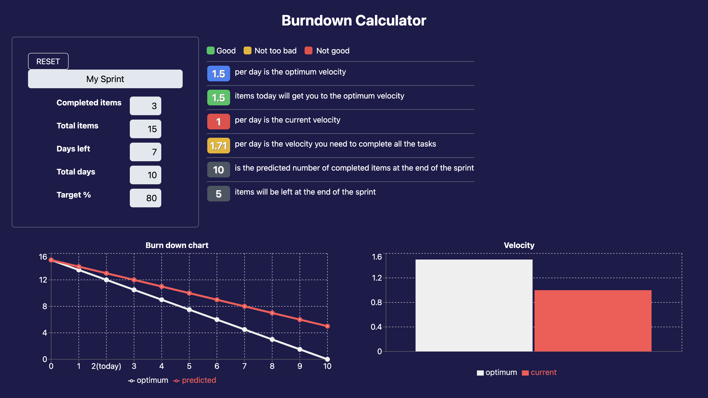

# Burndown Calculator

Simple web app for calculating sprint burndown and predicting stats at the end of a sprint



## How it works

Url query params are used as the initial state. This means there's no need for user authentication or data persistence since the url determines the state.

The form has it's own state but it updates the url on submit.

## Development

Clone the repo

```bash
git clone url
```

Install dependencies

```bash
yarn
```

Start the dev server

```bash
yarn dev
```

## Built with

- [Vite](https://vitejs.dev)
- [React router](https://reactrouter.com)
- [Recharts](https://recharts.org)

## Todo

- [x] Improve reset button look
- [x] Confirmation dialog before reset
- [ ] Validate current store data before displaying results
- [ ] Add share button that copies link to clipboard and shows a text box you can also copy from
- [ ] Improve number trimmer function in editor
- [ ] Add nice meta tags with summary and image
- [ ] Add content to welcome page
- [ ] Add text blurb when results aren't shown yet
- [ ] Add pages with agile and scrum content
